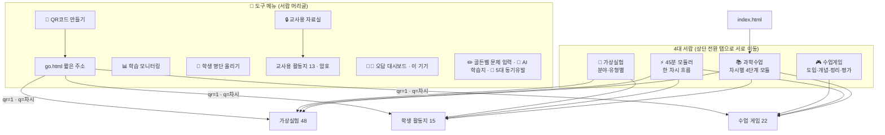
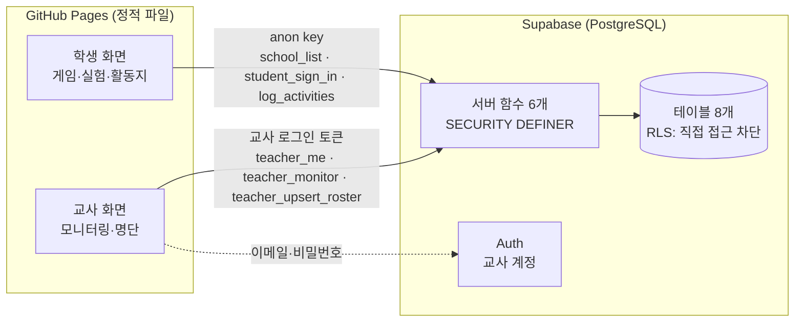

# 과학수업 서랍 — 전체 메뉴·인터페이스 구조 설계

학습 기록 DB를 통합한 뒤의 사이트 구조를 정리한 문서입니다. 화면 수는 이 저장소 기준입니다.

## 1. 한눈에 보기

| 구분 | 수 | 설명 |
|---|---|---|
| 서랍(허브) | 4 | 📚 과학수업 · ⚡ 45분 모듈러 · 🔬 가상실험 · 🎮 수업게임 |
| 수업 게임 | 22 | 개념 격추·수비대, 골든벨, 마인드맵, 사이언스마블 등 |
| 가상실험 | 48 | 자바실험실 시뮬레이션 (실험실 서랍 목록 기준, 게임·활동지 일부 포함) |
| 학생 활동지 | 15 | 정답 없음(학생용) |
| 교사 도구 | 20 | 교사용 활동지 13(암호) · 교사용 자료실 · QR 만들기 · 오답 대시보드 · 골든벨 문제 입력 · AI 학습지 · **학습 모니터링** · **명단 올리기** |
| 시스템 | 4 | index · go(QR 짧은 주소) · 404 · 배포 점검 |

사용자는 둘입니다.
- **교사**: 전자칠판·교사 PC. 서랍에서 수업을 고르고, QR을 띄우고, 학습 기록을 봅니다.
- **학생**: 휴대폰·태블릿·교실 PC. QR로 들어와 게임·실험·활동지를 하고, 등록하면 기록이 남습니다.

## 2. 정보 구조(IA)



## 3. 인터페이스 계층

모든 화면은 다섯 가지 공통 층을 조합해 만듭니다.

| 층 | 어디에 | 구성 | 부품 |
|---|---|---|---|
| **① 서랍 머리글** (2단, 87px) | 서랍 4개 | 1단: 검색 · 서랍 전환 · 🙋 학생 · 🧠 가이드 · 🧰 도구 / 2단: 학년·단계 칩 · 선택상자 · 항목 수 / 하단 1행 | `drawer-shell` (서랍 파일 안) |
| **② 콘텐츠 머리글** | 게임·실험·활동지 | 제목 · ↺ 처음 화면 · 📱 QR · 🎵🔔 소리 · 🙋 학생 · 서랍 링크 | 통일 머리글 + `kjs-qr.js` · `kjs-sound.js` · `kjs-db.js` |
| **③ 차시 선택 메뉴** | 게임 11종 | 학년 → 대단원 → 중단원·차시 카드, 검색, 주소 `?q=` 로 바로 열기 | `kjs-menu` (게임 파일 안) |
| **④ 학생 집중 모드** | QR 접속(`?qr=1`) | 서랍 이동·차시 메뉴 숨김, 📱 배지, ↺ 다시하기, 🙋 등록 안내 1회 | `qr-focus` (모든 화면 `<head>`) |
| **⑤ 교사 전용** | 교사 화면 | 암호 잠금(교사용 활동지) · 교사 로그인(모니터링·명단) | 암호화 로더 · `kjs-db.js` |

### 학습 결과를 만드는 공통 부품

| 부품 | 역할 | 기기 저장 | DB로 가는 값 |
|---|---|---|---|
| `kjs-scoreboard.js` | 개인·모둠 순위표 | `kjs-scoreboard-v1` | 게임 이름·단원·차시·점수·정확도 |
| `kjs-insight.js` | 오답 TOP 3·초성 힌트 | `kjs-insight-v1` | 틀린 개념 목록(`detail.wrong`)·정답/오답 수 |
| `kjs-db.js` | 학생 등록·자동 기록·교사 API | `kjs-db-student`, `kjs-db-queue` | 위 두 부품 결과를 **한 건으로 합쳐** 전송, 실험·활동지는 사용 시간 |

## 4. 사용자 흐름

### 교사: 학기 초 한 번
```
Supabase 설정(db/README.md) → 🧰 도구 → 👥 학생 명단 올리기 → 엑셀 끌어다 놓기 → 미리보기 확인 → 올리기
```

### 교사: 수업 시간
```
서랍에서 차시 선택 → 게임/실험 열기 → 머리글 📱 QR → 전자칠판에 크게 띄움
                                     ↓ (학생들이 찍음)
                                 수업 중 📊 학습 모니터링 (실시간 1분 새로고침)
                                     ↓
             수업 끝: 학급 카드의 "많이 틀린 개념"부터 짚어 주기 · 미참여 학생 확인
```

### 학생
```
QR 찍기 → (처음 한 번) 🙋 학년·반·번호·이름 등록 → 지정된 차시 바로 시작(집중 모드)
        → 게임 종료 시 점수·정확도·틀린 개념 자동 기록 / 실험·활동지는 사용 시간 기록
        → 인터넷이 끊겨도 기기에 모았다가 연결되면 전송
```

## 5. 데이터 구조

### 저장 위치
| 데이터 | 설정 전(오프라인 교실) | DB 연결 후 |
|---|---|---|
| 순위표·이 기기 오답 기록 | 기기 브라우저 | 기기 브라우저 (그대로) |
| 학생별 학습 기록 | 없음 | **Supabase `learning_activities`** |
| 학생 명단 | 없음 | `academic_years → schools → students` |
| 교사 계정·담당 학교 | 없음 | Supabase Auth + `teachers`, `teacher_schools` |

### 학습 활동 기록 규칙
| 화면 | 언제 | activity_type | 주요 값 |
|---|---|---|---|
| 점수·오답 부품을 쓰는 게임 (개념 격추·수비대·십자말풀이·회로 테트리스) | 게임이 끝날 때 | game | 점수, 정확도, 진도 100, 차시 코드, 틀린 개념, 걸린 시간 |
| 가상실험 | 화면을 떠날 때(30초 이상) | simulation | 사용 시간, 진도(5분 = 100%) |
| 활동지 | 화면을 떠날 때(30초 이상) | worksheet | 사용 시간, 진도 |
| 그 밖의 게임 | 화면을 떠날 때(30초 이상) | game | 사용 시간 |
| 서랍 | 기록 안 함 | — | — |

## 6. 시스템 구성과 보안



- 화면은 테이블에 **직접 접근할 수 없습니다**(RLS 켜고 정책 없음). 서버 함수만 부를 수 있고, 함수가 입력을 다시 검증합니다.
- 학생 함수는 누구나(anon) 부를 수 있지만, 명단과 **학년·반·번호·이름이 모두 맞아야** 기기 토큰을 받습니다. 토큰으로는 자기 기록 쓰기만 할 수 있고 읽기는 못 합니다.
- 교사 함수는 로그인한 교사 중 `teacher_schools`에 **그 학교가 등록된 교사만** 결과를 받습니다.
- anon key는 공개용이라 GitHub에 올라가도 됩니다. **service_role 키는 절대 화면·저장소에 넣지 않습니다.**

## 7. 운영 모드

| 모드 | 조건 | 동작 |
|---|---|---|
| 오프라인 교실 | `sounds/kjs-db-config.js`의 `url` 비움(기본) | 지금과 똑같음. 🙋 버튼 없음, 기록 없음 |
| 온라인 + 기록 | `url`, `anonKey` 입력 | 🙋 학생 등록·자동 기록, 교사 모니터링·명단 올리기 사용 |

## 8. 저장소 구조

```
/                         사이트 (GitHub Pages 루트)
├─ index.html, go.html, 404.html, 배포_점검.html
├─ 통합_과학수업_서랍.html · 45분_모듈러_수업서랍.html · 자바실험실_서랍.html · 시작하기_수업게임서랍.html
├─ (게임 22 · 가상실험 48 · 활동지 15 · 교사 도구 20).html
├─ sounds/                공통 부품
│   ├─ kjs-db-config.js   ← DB 연결 설정 (여기만 고치면 켜짐)
│   ├─ kjs-db.js          학생 등록·자동 기록·교사 API
│   ├─ xlsx.full.min.js   엑셀 읽기(SheetJS, Apache-2.0)
│   ├─ kjs-sound.js · kjs-scoreboard.js · kjs-insight.js · kjs-qr.js
│   └─ *.mp3
├─ 낱말퍼즐_단어목록/
├─ db/                    학습 기록 DB
│   ├─ README.md          Supabase 설치 안내
│   ├─ schema_postgresql.sql · supabase_api.sql
│   ├─ monitoring_queries.sql
│   ├─ tools/            파이썬 도구(명단 업로드·모니터링·활동 기록)
│   └─ tests/            시험(권한·함수·브라우저 통합)
└─ docs/사이트_구조_설계.md  (이 문서)
```
